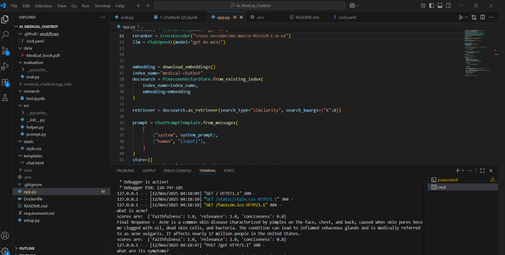

🏥 Medical Chatbot using RAG, HYDE, Re-ranking & LLM-as-a-Judge Evaluation
# Build-a-Complete-Medical-Chatbot-with-LLMs-LangChain-Pinecone-Flask-AWS

A production-grade Medical Question-Answering Chatbot built using Retrieval-Augmented Generation (RAG) enhanced with HYDE (Hypothetical Document Embeddings) and Cross-Encoder Re-ranking for high-quality medical responses. The system is fully deployed on AWS EC2, optimized for reliability, scalability, and real-world usage.

🚀 Key Features
🔍 1. RAG Pipeline

Converts user queries into vector embeddings

Retrieves top-k relevant medical documents

Generates grounded, factual responses

🧠 2. HYDE — Hypothetical Document Embeddings

LLM creates a hypothetical answer to enrich the query

Increases semantic recall

Greatly boosts accuracy on ambiguous questions

🎯 3. Cross-Encoder Re-ranking

Retrieved documents are re-ranked using a cross-encoder model

Ensures the most relevant context goes to the LLM

Reduces hallucinations significantly

✔️ 4. LLM-as-a-Judge RAG Evaluation

This project includes a rigorous evaluation pipeline using an LLM Judge to measure RAG performance across:

📊 Evaluation Metrics

Faithfulness Score

Whether the answer strictly follows retrieved context

Relevancy Score

Whether the retrieved context matches the query

Answer Correctness

LLM judge compares generated vs. ground-truth answers

 

# How to run?
### STEPS:

Clone the repository

```
git https://github.com/abhinav7876/Medical-Chatbot.git
```
### STEP 01- Create a conda environment after opening the repository

```
conda create -p venv python==3.10 -y
```

```
conda activate venv/
```


### STEP 02- install the requirements
```
pip install -r requirements.txt
```


### Create a `.env` file in the root directory and add your Pinecone & openai credentials as follows:

```
PINECONE_API_KEY = "xxxxxxxxxxxxxxxxxxxxxxxxxxxxx"
OPENAI_API_KEY = "xxxxxxxxxxxxxxxxxxxxxxxxxxxxx"
```


```
# run the following command to store embeddings to pinecone
python store_index.py
```

```
# Finally run the following command
python app.py
```

Now,
```
open up localhost:
http://127.0.0.1:8080
```


### Techstack Used:

- Python
- LangChain
- Flask
- GPT
- Pinecone


# AWS-CICD-Deployment-with-Github-Actions

## 1. Login to AWS console.

## 2. Create IAM user for deployment

	#with specific access

	1. EC2 access : It is virtual machine

	2. ECR: Elastic Container registry to save your docker image in aws


	#Description: About the deployment

	1. Build docker image of the source code

	2. Push your docker image to ECR

	3. Launch Your EC2 

	4. Pull Your image from ECR in EC2

	5. Lauch your docker image in EC2

	#Policy:

	1. AmazonEC2ContainerRegistryFullAccess

	2. AmazonEC2FullAccess

	
## 3. Create ECR repo to store/save docker image
    - Save the URI: 795544035517.dkr.ecr.us-east-1.amazonaws.com/medicalbot

	
## 4. Create EC2 machine (Ubuntu) 

## 5. Open EC2 and Install docker in EC2 Machine:
	
	
	#optinal

	sudo apt-get update -y

	sudo apt-get upgrade
	
	#required

	curl -fsSL https://get.docker.com -o get-docker.sh

	sudo sh get-docker.sh

	sudo usermod -aG docker ubuntu

	newgrp docker
	
# 6. Configure EC2 as self-hosted runner:
    setting>actions>runner>new self hosted runner> choose os> then run command one by one


# 7. Setup github secrets:

   - AWS_ACCESS_KEY_ID
   - AWS_SECRET_ACCESS_KEY
   - AWS_DEFAULT_REGION
   - ECR_REPO
   - PINECONE_API_KEY
   - OPENAI_API_KEY